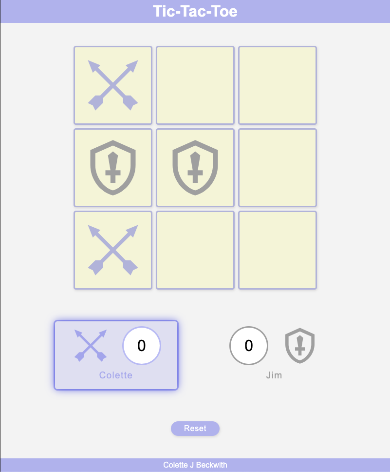
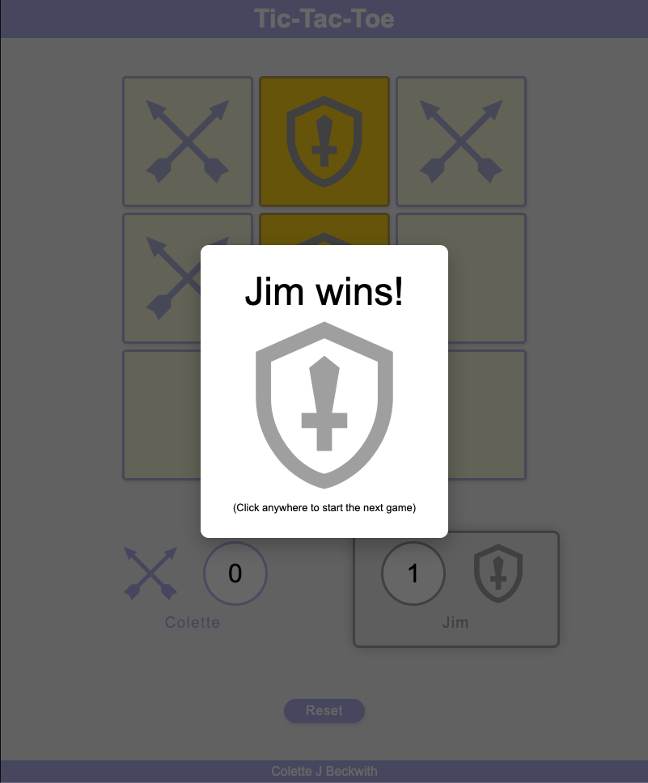

# Tic-Tac-Toe

Live Demo: 

A browser-based Tic-Tac-Toe game built with vanilla JavaScript, focused on clean separation of concerns and maintainable state management rather than framework usage.

## Screenshots

## Overview

This project was built as a small frontend architecture exercise. The goal was to implement a simple game while keeping the game logic, rendering, and interaction layers clearly separated. The code is structured using the module pattern to avoid global state and keep responsibilities well-defined.

The application supports two local players, tracks scores across rounds, alternates the starting player automatically, and provides visual feedback for wins and active turns.

## Implementation Notes

The project is divided into three main modules:

* **GameBoard**
  Owns the board state and exposes methods for updating and resetting it.

* **DisplayController**
  Responsible for all DOM interaction: rendering the grid, updating scores, highlighting winning cells, and managing overlays.

* **GameController**
  Coordinates gameplay. Handles turn order, win/tie detection, score tracking, and round resets.

This separation keeps rendering logic out of the game rules and makes the flow of state easier to track.

## Features

* Two-player local gameplay
* Name entry via modal at game start
* Score tracking across rounds
* Alternating starting player each round
* Visual highlight for the active player
* Winning pattern highlight
* End-of-round overlay with result
* Full match reset option

## Technical Approach

* Vanilla JavaScript only (no frameworks)
* Module pattern (IIFE) for encapsulation
* Minimal global scope
* Event-driven UI updates

The emphasis was on clarity and structure over abstraction.

## Running the Project

No build tools or dependencies are required.

Open `index.html` in any modern browser.

## Limitations

- Local multiplayer only
- No persistent storage for scores
- No AI opponent

## Possible Extensions

If this were taken further, the next steps would likely be:

* Single-player mode with basic AI
* Persisting match history
* Mobile interaction refinements
* Unit tests around win detection logic

## Author

Colette J. Beckwith
